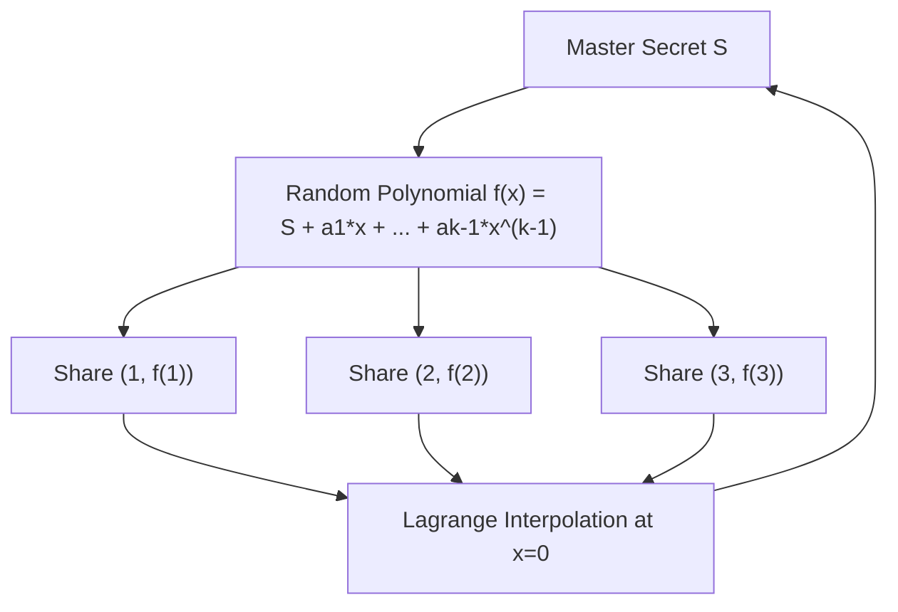

# Shamir's (k, n) Secret Sharing Skill

High-efficiency, zero-dependency Python implementation of **Shamir's (k, n) Threshold Secret Sharing**.

## Features
- **Information-Theoretic Security**: Any \(k - 1\) shares reveal zero information regarding the underlying secret.
- **Lagrange Interpolation**: Reconstructs secret in \(O(k^2)\) modular operations over Mersenne prime \(2^{127} - 1\).
- **Zero External Dependencies**: Pure Python standard library (`secrets`).
- **Native MCP Protocol**: JSON-RPC 2.0 stdio server compatible with Claude Desktop, Cursor, and Windsurf.

## Architecture

